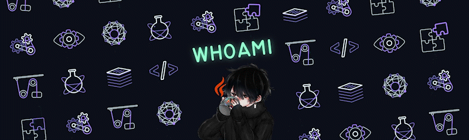

 

            
<!--  loli gif-->

<a href="https://github.com/wh0am-i">
            
|  |  |  |
| :-: | :-: | :-: |

|  |  |
| :-: | :-: |

            
 
<h2 align="center">/*When harpoons, air strikes and nukes fails*/</h2>
<h4 align="center"> Olá, meu nome é Pedro e tenho 18 anos, sou um entusiasta da programação, robótica e modelagem 3d. Sempre fui um curioso por natureza, assim, procuro saber como as "coisas" funcionam, se não funcionar ou não existir, eu mesmo crio, para mim o impossível é só questão de opinião. Costumo passar o tempo programando ou montando alguns circuitos. </h4> 
 
 
<!--

centraliza tudo
-->

<h2 align="center" > 💼 Formação: </h2>
<h4>  -Técnico em Desenvolvimento de Sistemas ✔ </h4> 
<h4>  -Aprendizagem Industrial em Telecomunicações ✔ </h4>
 
 

<h2 align="center">  💾 Experiências: </h2>
<h4>  -Incubação da Techmind em 2022 🧠 </h4> 
<h4>  -Trabalhei como jovem aprendiz na Intelbras no setor de redes da remanufatura IND 🏭 </h4> 
<h4>  -Participei do programa Inova Senai na fase estadual e nacional de 2021 à 2022, atuando na área de eletrônica, programação e modelagem 3d 🤖 </h4> 
<h4>  -Participei de diversos eventos de tecnologia, dentre eles o DSPI 2022, Innovation Camp 2022, GP de Inovação 2022 e Hackathon de Tecnologia 2023 🥇 </h4> 
<h4>  -Falha grave encontrada em programa privado da BugHunt 👾 </h4>
 
 

<h2 align="center"> 💻 Conhecimentos: </h2>
<h4>  -Java Dev Jr.</h4>
<h4>  -Python Dev Jr.</h4>
<h4>  -Full Stack Dev Jr.</h4>
<h4>  -Amante de Linux e shell script.</h4>
<h4>  -Amante de Arduino e eletrônica.</h4>

<h2 align="center"> 🛠 Ferramentas: </h2>

<a href="https://www.adobe.com/products/premiere.html" target="_blank">
            <!--
          </a>-->
          
                    
          
          
                                      <!--   -->
                              
          
                      
                                        
          
                 <!--   -->
                                   <!--               -->
                                       <!--   -->
           
           
          
 
 
           
