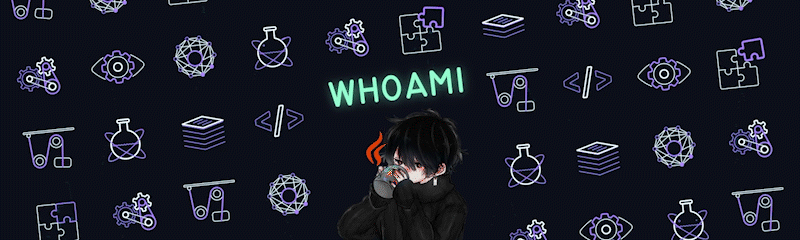

     

     
     
    

     

 
<h2 align="center">/*When harpoons, air strikes and nukes fails*/</h2>
<h4 align="center"> Olá, sou um entusiasta da programação, eletrônica e mecânica. Sempre procurei saber como tudo funciona, se não funcionar ou não existir, vou atrás da solução. Costumo passar o tempo programando, montando alguns circuitos ou criando projetos. </h4> 
 
 

<h2 align="center"> 🛠 Ferramentas: </h2>

    
    
    
    
    
    
    
    
    
    
    

 
 
